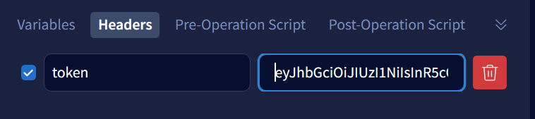

# GRAPHQL API DOCUMENTATION

## Prerequisites to run this git repo
1. MongoDB compass installed on your system
2.  NodeJS and npm installed in your machine (https://nodejs.org/en/)

## Steups to setup the application
1. Clone the repository using `link`
2. Change directory to server
    ```bash
    cd server
    ```
3. Run below command to get all node_modules in 
package.json
    ```bash
    npm install
    ```
4. Create a .env file with following content:
    ```bash
    JWT_SECRET=<Your Secret Key>
    ```
5. Run below command to start the Graphql API
    ```bash
    npm start
    ```

After  running above steps, you will have an active Graphql API which is listening at
http://localhost:4000/graphql


# Introduction to the Functionality of GrpahQL API

1. We have 3 roles
  - Admin
  - Employer
  - Employee
2. Admin has authority over employer and employee
3. Employer has authority over employee
<br></br>
# ADMIN


1. Navigate to http://localhost:4000/graphql You will see the Apollo GraphQL Server UI which will have list of Queries and Mutations that can be done with our GraphQL API


## Admin Login

1. For login click on Mutation -> adminLogin
2. Provide username and password of admin provided below
```bash
{
  "admin": {
    "username": "admin",
    "password": "admin"
  }
}
```
3. Click on Run mutation User will be logged in successfully
4. When a user logs in a JWT Token will be returned . This token is used for role based Authentication(Copy the token).
5. We will be using this token later for adding new Employer,new Employee,getting list of Employees/Employer etc

# Employer

## Adding new Employer

1. Choose addEmployer under list of Provided Mutations
2. Provide  details about your employer in the Variables section
3. Use the copied token of admin before running this Mutation as only admin can add new EMployer
4. Under the headers section present beside variables ,enter header key name as "token" and value as copied token after admin login

4. After Running the Mutation, Newly added Employer Details will appear in the Response Section

## Update Employer Name

1. You can also update name of Employer being an admin 
2. Provide Id of the employee whom you want to update and new name  in the Variable section
3. Provide the token of admin in headers section 
4. You will get Updated Name and other details of Employer in response section

## Get Employer (Query-->getEmployers)

Admin can Get all the employers using this query

## Get EmployerById (Query-->getEmployerById)

1. Admin(token) or a specific employer (token)themselves can Get employers by their id using this query
2. Provide employer id in the variables section before running this query

## Employer Login

### Note : Employer's Password Expires every 48 hours so incase u login without changing password after 48 hours .You will get a Error Message saying Password Expired Please Rest.

1. An Employer after logging in can do the following things
 - Create new Employees
 - Update an Employer or email of a particular employee given his id
 - Delete employees
 - Get all employees or a specific employee
2. Provide appropriate details of employer for logging in and  click on "Run Mutation"
3.  If everything is correct he will be Logged In Successfully otherwise there might be some error with provided credentials
4. Use the Token of  that user which is provided in the response section for further operations from Employer.

## update Password of Employer.

1. In case Employer Password is expired or he wants to change his password to a new one
2. Mutation-->updateEmployerPassword
3. Provide email and oldPassword of the employer  who's password needs to be updated and provide new password  in the variable section
5. If everything goes right then you will receive response --> Employer Password Updated Successfully

## Delete Employer.

1. Admin can Delete Employers by providing id of employer to be deleted in variables section
2.  Token of admin should be provided in headers section
3. When an employer is deleted all other employees under him are also deleted.

# Employee

Similarly u can perform Same Operations like Employer to Employee


1. Update Details of any Employee(Both Employer and Admin)  UpdateEmployeeEmail
   > Note: Only Email and Assigned Employer can be changed
2. Employee can login using their correct credentials and get their token.
- ##### Note : Employee's Password Expires every 24 hours so incase u try to login without changing password after 24 hours .You will get a Error Message saying Password Expired Please Rest.

3. Update Employee Data 
  - Employee can update details like address and his phone number of themselves using the their particular token

4. Employers and Admin(with help of tokens) can delete Employees using their id
5. Get Employees By Id and Get All Employees can be done.
## Note: You can also retreive additicnal information of an employer when you get information of an Employee
```bash
query Query{
  getEmployees {
    username,
    address
    employer {
      username
      address
    }
  }
}
```